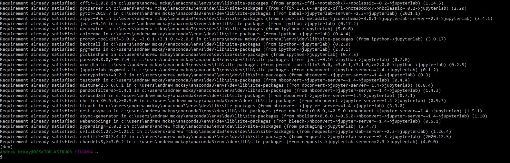
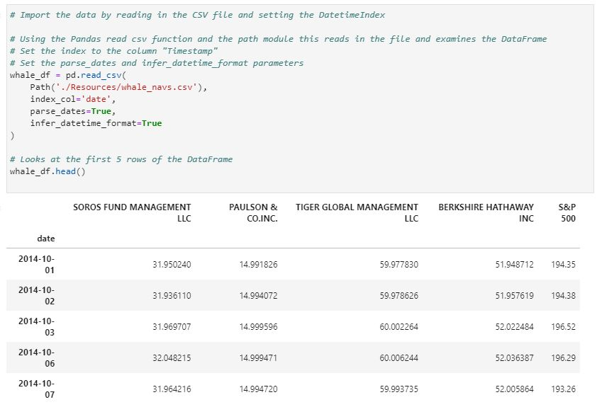
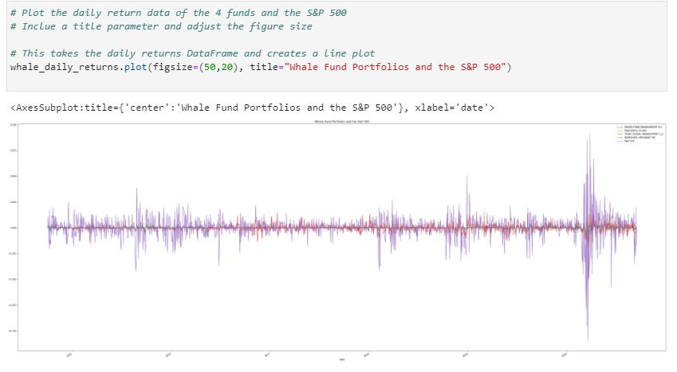
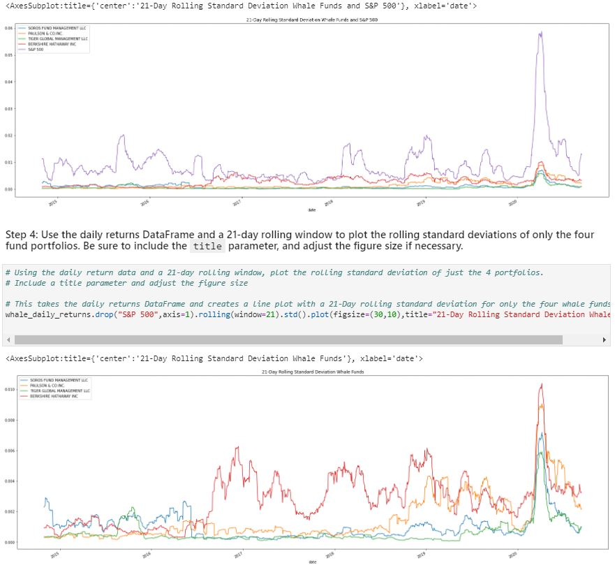
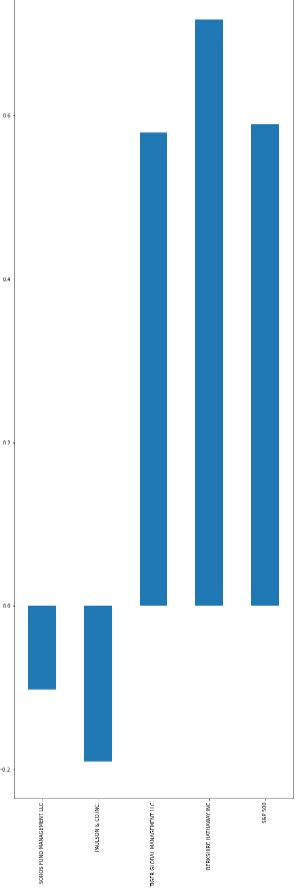
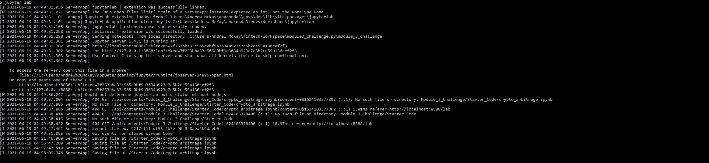

# Module4_Challenge - Analyzing Portfolio Risk and Return


This Analyzing Portfolio Risk and Return application uses Jupyter Notebook to compare the risk and return between four whale funds to the S&P 500. The application also helps understand the risk and return of the the four whale funds vs. S&P 500 with visual analysis.

---

## Technologies

This was run on a pc using Windows 10

This project leverages python 3.8.8 with the follwing packages:

* [pandas](https://pandas.pydata.org/docs) - For manipulating the DataFrame.

* [Jupyter Lab](https://jupyterlab.readthedocs.io.en/stable) - For code and visualizations.

* [pathlib](https://docs.python.org/3/library/pathlib.html) - For location through the directory and file path.

* [numpy](https://numpy.org/install/) - For scientific computing with python

---

## Installation Guide


```python
  pip install jupyter lab
```
In gitbash after you have activated your dev environment, install the following:

*Jupyter Lab

    `pip install jupyterlab`



---

## Examples

The images below show the different types of charts used in the Analyzing Portfolio Risk and Return application. By looking at these outputs we can analyze the data and answer the question of which whale funds have the highest and lowest risk and return.









---

## Usage

This section should include screenshots, code blocks, or animations explaining how to use your project.

From the command line you enter jupyter. 



Once the application is launched in Jupyter Lab you run through the code blocks to get your data.


Once all the cell blocks for the Analyzing Portfolio Risk and Return have been run you can make your analysis of the data.

---

## Contributors

Andrew McKay

Email: andrew.v.mckay@gmail.com

---
